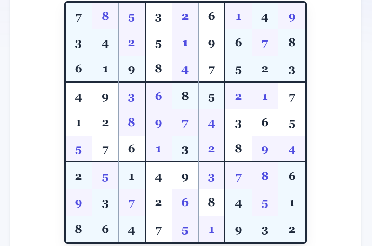

# Fall EECS 368 Assignment 4 - Lucas Frias

Welcome back and happy October. Today is one of the harder EECS assignments I've done, but I'm all the more excited. Today's prompt is Sudoku. Personally, I hate Sudoku. I think that it's not a useful puzzle because I don't realy reason in a geometric way and it's hard for me to think about. Thankfully, we now have computers to solve this problem. Today will be an interesting comparison between two new LLM models: Opus 5.5 on Medium reasoning (from Anthropic) and Google's Gemini 3.6 Flash.

As stated in the previous assignments, I was able to access Anthropic's models by creating a free account on their website. Then, in a normal chat window, I put the prompt I'll soon display below and located in PROMPT.md in the directory /prompt_rubric in this CWD you're reading this from. I'll be referring to this model as Opus for the remainder of the discussion.

On the other side, Gemini is new but about the same. Log in with your Google Account on the website, and then you are able to put in some sort of prompt into the prompt window. The default model (Gemini 3.6 Flash) is the one I used, and likewise I'll be referring to this as Flash (although there are many Flash models)


# Prompt

```
generate C++ code using objects, not functions, to implement
the following requirements (Note: You may use either ChatGPT or CoPilot as one
of your choices, but not both. They are essentially the same GenAI.):
• Sudoku is a number puzzle in which a 9x9 grid is subdivided into 9 3x3 sub-
grids, or blocks.
• A typical puzzle is shown here (image credit: Wikimedia Commons):
o
• Each of the cells in the puzzle must be filled in with a single digit 1-9, subject
to the following constraints:
o Each digit from 1 to 9 must appear exactly once in each row.
o Each digit from 1 to 9 must appear exactly once in each column.
o Each digit from 1 to 9 must appear exactly once in each block.
• Published puzzles are usually constructed to have a unique solution. This
requires that at least 17 cells be filled in (and may require more; depending on
the puzzle and which cells are empty, as many as 78 filled cells can be
required to guarantee uniqueness). In general, the number of cells that are
already filled in is not a particularly good indicator of how difficult a Sudoku
puzzle is to solve.
• The Sudoku problem, then, is this: Given a partially completed Sudoku
puzzle, find the (or at least a) solution; if no solution exists, prove that.
• It is possible to solve a Sudoku puzzle entirely through logic. For example, in
the above puzzle, consider the bottom right block, top right cell. Because of
other numbers in the same row, column, or grid, that number cannot be 1, 2, 3,
5, 6, 7, 8, or 9, and so must be 4. By proceeding in this fashion, using these
and more advanced deduction rules, it’s possible to gradually fill in the entire
grid.
• That is not the approach we’re going to use. Instead, we’re going to
implement a brute-force search, in which we exhaustively try possibilities
until we find a solution. This will be slower to run but is easier to solve. (And
by “slower to run,” we mean it'll finish in a few tenths of a second rather than
a few milliseconds.)
• Here’s the idea: Suppose we have a Sudoku puzzle of which k of the 81 cells
are unfilled. We identify an empty cell and deduce a list of candidates for
what might go into that cell. If there are no such values (all digits are
accounted for elsewhere in the same row, column, or grid), then we must have
made a mistake in filling in the k cells and return a no-solution-found result.
Otherwise, we try putting the first candidate value into the empty cell, and see
if we can find a solution with the k+1 cells filled (i.e. a recursive call). If we
get a no-solution-found to the first candidate, then we try the next, and so on,
until we either find a solution (k == 81) or determine that no solution exists
2. 3. 4. 5. 6. (all candidates report no solution, which again implies we took a wrong path
somewhere earlier).
• This approach, by the way, is called depth-first search with backtracking. For
each empty cell we make an attempt and see how far we can get with it. If we
fail to find a solution, we back up until we find something else to try, and so
on. If a solution exists, we are guaranteed to find it, because we exhaustively
try all possibilities.
• You are given five files (puzzle1.txt through puzzle5.txt), each containing a
Sudoku puzzle. Digits already filled in have been placed, and an underscore
character (_) is used to indicate a blank square.
• Write a recursive object-oriented program to find the solution to the five
puzzle files.
• The output for each solution, should include:
o The puzzle file name (e.g., puzzle1.txt)
o The puzzle from the file printed out.
o The solution to the puzzle printed out or if no solution is found, “No
solution found” printed out.
• The solution may not be unique; if there is more than one solution to the
puzzle, your program should print them all out.
• To help you debug your program, solution1.txt is a solution to puzzle1.txt.
```

Additionally, the files puzzle1.txt ... puzzle3.txt were given, as well as the solution.txt. I wanted to introduce less test cases but still give each AI equal footing. These were uploaded with the feature (Upload files...) integrated into both chatbot interfaces.

## Speed
I don't usually make any notes on the generation, but this is noteworthy. Opus spent about ~1:00 reasoning and then came out with its output. Gemini Flash took 3 seconds! I understand that the model is designed to generate quickly, but it blew me out of the water with its speed.

# Correctness
I suspect that this is a textbook problem, because both LLMs implemented the answer well and quickly. It should be noted that by default, based on the rubric both Flash and Opus attempt to access the current directory for files named puzzle1....5.txt in order to process inputs

## Simple Correctness
On a first run, the programs outputted nearly the same 

<table>
<tr><th>./anthropic</th><th>./google</th></tr>
<tr><td><pre>
Puzzle:
5 _ _ | _ _ _ | 1 7 _
1 _ 6 | 5 _ 9 | _ 4 _
4 7 2 | 1 _ 6 | _ _ _
------+-------+------
9 _ _ | _ _ _ | 5 _ _
_ 1 8 | _ 9 5 | 4 _ _
6 _ _ | 4 _ 2 | 3 8 9
------+-------+------
_ 4 _ | _ _ _ | 9 3 _
_ 9 _ | 7 _ 3 | _ 5 _
2 6 3 | 9 5 8 | 7 1 4
</pre></td><td><pre>
Initial Puzzle:
5 _ _ _ _ _ 1 7 _
1 _ 6 5 _ 9 _ 4 _
4 7 2 1 _ 6 _ _ _
9 _ _ _ _ _ 5 _ _
_ 1 8 _ 9 5 4 _ _
6 _ _ 4 _ 2 3 8 9
_ 4 _ _ _ _ 9 3 _
_ 9 _ 7 _ 3 _ 5 _
2 6 3 9 5 8 7 1 4
</pre></td></tr>
<tr><td><pre>
Solution:
5 3 9 | 8 2 4 | 1 7 6
1 8 6 | 5 7 9 | 2 4 3
4 7 2 | 1 3 6 | 8 9 5
------+-------+------
9 2 4 | 3 8 7 | 5 6 1
3 1 8 | 6 9 5 | 4 2 7
6 5 7 | 4 1 2 | 3 8 9
------+-------+------
7 4 5 | 2 6 1 | 9 3 8
8 9 1 | 7 4 3 | 6 5 2
2 6 3 | 9 5 8 | 7 1 4
</pre></td><td><pre>
Solution 1:
5 3 9 8 2 4 1 7 6
1 8 6 5 7 9 2 4 3
4 7 2 1 3 6 8 9 5
9 2 4 3 8 7 5 6 1
3 1 8 6 9 5 4 2 7
6 5 7 4 1 2 3 8 9
7 4 5 2 6 1 9 3 8
8 9 1 7 4 3 6 5 2
2 6 3 9 5 8 7 1 4
</pre></td></tr>
<tr><td></td><td><pre>
Solutions found: 1
</pre></td></tr>
</table>

## puzzle2.txt

<table>
<tr><th>./anthropic</th><th>./google</th></tr>
<tr><td><pre>
Puzzle:
5 3 _ | 8 _ 4 | _ 7 6
1 _ 6 | _ 7 9 | _ 4 3
_ 7 _ | _ 3 6 | _ _ 5
------+-------+------
9 2 4 | _ 8 _ | 5 6 _
3 _ 8 | 6 9 _ | 4 2 7
_ 5 _ | 4 1 2 | 3 _ _
------+-------+------
7 4 5 | _ 6 _ | 9 _ 8
8 _ 1 | 7 _ 3 | 6 5 2
_ 6 3 | 9 5 _ | 7 _ 4
</pre></td><td><pre>
Initial Puzzle:
5 3 _ 8 _ 4 _ 7 6
1 _ 6 _ 7 9 _ 4 3
_ 7 _ _ 3 6 _ _ 5
9 2 4 _ 8 _ 5 6 _
3 _ 8 6 9 _ 4 2 7
_ 5 _ 4 1 2 3 _ _
7 4 5 _ 6 _ 9 _ 8
8 _ 1 7 _ 3 6 5 2
_ 6 3 9 5 _ 7 _ 4
</pre></td></tr>
<tr><td><pre>
Solution:
5 3 9 | 8 2 4 | 1 7 6
1 8 6 | 5 7 9 | 2 4 3
4 7 2 | 1 3 6 | 8 9 5
------+-------+------
9 2 4 | 3 8 7 | 5 6 1
3 1 8 | 6 9 5 | 4 2 7
6 5 7 | 4 1 2 | 3 8 9
------+-------+------
7 4 5 | 2 6 1 | 9 3 8
8 9 1 | 7 4 3 | 6 5 2
2 6 3 | 9 5 8 | 7 1 4
</pre></td><td><pre>
Solution 1:
5 3 9 8 2 4 1 7 6
1 8 6 5 7 9 2 4 3
4 7 2 1 3 6 8 9 5
9 2 4 3 8 7 5 6 1
3 1 8 6 9 5 4 2 7
6 5 7 4 1 2 3 8 9
7 4 5 2 6 1 9 3 8
8 9 1 7 4 3 6 5 2
2 6 3 9 5 8 7 1 4
</pre></td></tr>
<tr><td></td><td><pre>
Solutions found: 1
</pre></td></tr>
</table>

## puzzle3.txt

<table>
<tr><th>./anthropic</th><th>./google</th></tr>
<tr><td><pre>
Puzzle:
7 _ _ | 3 _ 6 | _ 4 _
3 4 _ | 5 _ 9 | 6 _ 8
6 1 9 | 8 _ 7 | 5 2 3
------+-------+------
4 9 _ | _ 8 5 | _ _ 7
1 2 _ | _ _ _ | 3 6 5
_ 7 6 | _ 3 _ | 8 _ _
------+-------+------
2 _ 1 | 4 9 _ | _ _ 6
_ 3 _ | 2 _ 8 | 4 _ 1
8 6 4 | 7 _ _ | 9 3 2
</pre></td><td><pre>
Initial Puzzle:
7 _ _ 3 _ 6 _ 4 _
3 4 _ 5 _ 9 6 _ 8
6 1 9 8 _ 7 5 2 3
4 9 _ _ 8 5 _ _ 7
1 2 _ _ _ _ 3 6 5
_ 7 6 _ 3 _ 8 _ _
2 _ 1 4 9 _ _ _ 6
_ 3 _ 2 _ 8 4 _ 1
8 6 4 7 _ _ 9 3 2
</pre></td></tr>
<tr><td><pre>
Solution:
7 8 5 | 3 2 6 | 1 4 9
3 4 2 | 5 1 9 | 6 7 8
6 1 9 | 8 4 7 | 5 2 3
------+-------+------
4 9 3 | 6 8 5 | 2 1 7
1 2 8 | 9 7 4 | 3 6 5
5 7 6 | 1 3 2 | 8 9 4
------+-------+------
2 5 1 | 4 9 3 | 7 8 6
9 3 7 | 2 6 8 | 4 5 1
8 6 4 | 7 5 1 | 9 3 2
</pre></td><td><pre>
Solution 1:
7 8 5 3 2 6 1 4 9
3 4 2 5 1 9 6 7 8
6 1 9 8 4 7 5 2 3
4 9 3 6 8 5 2 1 7
1 2 8 9 7 4 3 6 5
5 7 6 1 3 2 8 9 4
2 5 1 4 9 3 7 8 6
9 3 7 2 6 8 4 5 1
8 6 4 7 5 1 9 3 2
</pre></td></tr>
<tr><td></td><td><pre>
Solutions found: 1
</pre></td></tr>
</table>

## puzzle4.txt

<table>
<tr><th>./anthropic</th><th>./google</th></tr>
<tr><td><pre>
Puzzle:
7 3 2 | _ 8 4 | 6 9 1
9 1 _ | 3 _ _ | 5 2 _
8 _ _ | 9 _ 2 | 7 3 4
------+-------+------
5 4 9 | _ _ _ | 8 6 3
1 _ _ | _ 3 _ | 2 _ 7
_ 2 3 | _ 4 8 | 9 1 _
------+-------+------
3 9 _ | 8 5 _ | 4 7 2
_ 7 _ | 4 _ 3 | _ _ 6
4 6 8 | _ 7 _ | _ 5 9
</pre></td><td><pre>
Initial Puzzle:
7 3 2 _ 8 4 6 9 1
9 1 _ 3 _ _ 5 2 _
8 _ _ 9 _ 2 7 3 4
5 4 9 _ _ _ 8 6 3
1 _ _ _ 3 _ 2 _ 7
_ 2 3 _ 4 8 9 1 _
3 9 _ 8 5 _ 4 7 2
_ 7 _ 4 _ 3 _ _ 6
4 6 8 _ 7 _ _ 5 9
</pre></td></tr>
<tr><td><pre>
No solution found
</pre></td><td><pre>
No solution found
</pre></td></tr>
</table>

## puzzle5.txt

<table>
<tr><th>./anthropic</th><th>./google</th></tr>
<tr><td><pre>
Puzzle:
_ _ _ | _ _ 4 | 2 _ 1
_ _ _ | _ 7 _ | _ _ 5
_ _ 8 | 1 _ 5 | 7 _ _
------+-------+------
_ 4 1 | _ 3 2 | 8 _ _
3 8 9 | _ 5 6 | 1 2 7
2 _ _ | _ _ 8 | 3 _ _
------+-------+------
_ 2 4 | _ _ 7 | _ 1 _
8 3 6 | _ 9 _ | 4 _ _
_ _ 7 | _ _ 3 | 5 _ _
</pre></td><td><pre>
Initial Puzzle:
_ _ _ _ _ 4 2 _ 1
_ _ _ _ 7 _ _ _ 5
_ _ 8 1 _ 5 7 _ _
_ 4 1 _ 3 2 8 _ _
3 8 9 _ 5 6 1 2 7
2 _ _ _ _ 8 3 _ _
_ 2 4 _ _ 7 _ 1 _
8 3 6 _ 9 _ 4 _ _
_ _ 7 _ _ 3 5 _ _
</pre></td></tr>
<tr><td><pre>
Solution 1 of 2:
7 5 3 | 6 8 4 | 2 9 1
4 1 2 | 3 7 9 | 6 8 5
9 6 8 | 1 2 5 | 7 3 4
------+-------+------
6 4 1 | 7 3 2 | 8 5 9
3 8 9 | 4 5 6 | 1 2 7
2 7 5 | 9 1 8 | 3 4 6
------+-------+------
5 2 4 | 8 6 7 | 9 1 3
8 3 6 | 5 9 1 | 4 7 2
1 9 7 | 2 4 3 | 5 6 8
</pre></td><td><pre>
Solution 1:
7 5 3 6 8 4 2 9 1
4 1 2 3 7 9 6 8 5
9 6 8 1 2 5 7 3 4
6 4 1 7 3 2 8 5 9
3 8 9 4 5 6 1 2 7
2 7 5 9 1 8 3 4 6
5 2 4 8 6 7 9 1 3
8 3 6 5 9 1 4 7 2
1 9 7 2 4 3 5 6 8
</pre></td></tr>
<tr><td><pre>
Solution 2 of 2:
7 5 3 | 8 6 4 | 2 9 1
4 1 2 | 3 7 9 | 6 8 5
9 6 8 | 1 2 5 | 7 3 4
------+-------+------
6 4 1 | 7 3 2 | 8 5 9
3 8 9 | 4 5 6 | 1 2 7
2 7 5 | 9 1 8 | 3 4 6
------+-------+------
5 2 4 | 6 8 7 | 9 1 3
8 3 6 | 5 9 1 | 4 7 2
1 9 7 | 2 4 3 | 5 6 8
</pre></td><td><pre>
Solution 2:
7 5 3 8 6 4 2 9 1
4 1 2 3 7 9 6 8 5
9 6 8 1 2 5 7 3 4
6 4 1 7 3 2 8 5 9
3 8 9 4 5 6 1 2 7
2 7 5 9 1 8 3 4 6
5 2 4 6 8 7 9 1 3
8 3 6 5 9 1 4 7 2
1 9 7 2 4 3 5 6 8
</pre></td></tr>
<tr><td></td><td><pre>
Solutions found: 2
</pre></td></tr>
</table>

> This table was generated by Opus 5.5, copied from my ouputs

As you can see, the outputs are nearly identitcal. I actually had to diff the files to make sure that I didn't copy the same executable twice. What Opus 5.5 did a minute, Flash did in a couple of seconds, generating the same outputs. I also went and tested this on a real Sudoku solver, which you can see the results of here for puzzle3

>Access the tool here https://anysudokusolver.com (retrived October 5th 4:00 PM)

<!--
Source - https://stackoverflow.com/a/41912122
Posted by Philipp Schwarz, modified by community. See post 'Timeline' for change history
Retrieved 2026-10-05, License - CC BY-SA 4.0
this was from me figuring out how to display an image in markdown lol
you're a real one if you're reading the bare markdown file
-->


> Problem 3, solved with an external tool


Both on the fact that every test input I checked was verified to be correct, and the LLMs have the same output too, I will say that these are, at least, functionally correct. 

## Bad Input
Incorrect input is a great test case, but Flash and Opus are both resilient, even though they do not operate on the principle of least suprise (that being, if there's something wrong or some sort of feature that should occur, defer to the expected result)

Both Flash and Opus will refuse to parse input files with more or less than the set number of lines. This itself is easy enough to check, but the added benefit is they allow for infinite whitespace (not newline, as that counts as a row with 0 elements). SO the input size is pretty liberal. 

I suspect, writing this before tearing down the code, that both just do a character regex removal for whitespace characters and then parse the file. What supports my hypothesis is how both files handle attempting to input a number higher than 1-9, which they will process as seperate numbers. Additionally, it detects non numeric characters and will specifically flag them as incorrect characters and stop execution of the program.

Generally, this is fairly robust. The only thing that is kind of bad is that number parsing because an invalid input file will appear valid (it will just cut off the excess numbers on the last row) so it appears to be a small execution flaw. Still has generally decent input handling for the program given, so I will give this good brownie points on this side too.


# Time Complexity

# Theoretical

In this one, I already have my work cut out for me. The prompts rubric given on Canvas specifically asks for a brute force implementation, with depth first search. This is really specific and the implementation that both follow, so we don't differ big here. First, we need to explain the process, which includes "greedy" solutions, branch trees, and the distribution of trees (explained to you by a sophomore CS student who is not all that good at algorithms).

## Brute Force

As alluded to, the prompt is specifically trying to find every solution not by any clever algorithm but by brute force. Our input size is 81 elements, but the amount of work we have to do is proporitional to the amount of empty squares. Let us denote N for this problem as 
```
n = spaces
```
where spaces are blank, unsolved squares from the input size. 

Let's take a simple 3x3 thing as an example:

```
-----------
| 1  _  3 |
| _  _  2 | 
| _  3 _ |
-----------

where n = 5 

and where the element range is 1 <= t <= 3
```

By solving this by brute force, we need to select every space and then follow every branch where we can insert an element. What does that mean?

Well, take the first row (1, _, 3). With this input, I cannot do 1 or 3 as a possible input. So I can denote that the A_ij (to use matrix notation, or in programming arr[i][j]) must be set to some value t (where t is bounded within my range) in one of my branches. We'll denote this change with

(A[i][j] = t) 

And we can represent series of these changes like so:

(A[i][j] = t) -> (A[m][n] = l)

Note that l is similarly bounded as t based on our Sudoku size

Notice that permutations of this algorithm can occur. We can say that

(A[i][j] = t) -> (A[m][n] = l)  == (A[m][n] = l) -> (A[i][j] = t)

as in these operations switched will result in the same board. This is true for any increasingly large input, and 
grows to the factorial, because for our N spaces, given there is some solution S, there are N! ways to represent that solution.

This is valid, and will let us produce the same solution. We don't ever implement any sort of algorithm to determine a check between branching because it would be difficult and not really worth it for Sudoku, but notice that we have to these extra calculations that confirm what we already know

Okay, now back to our practice Sudoku, let's say

A[0][1] = 2

```
-----------
| 1  2  3 |
| _  _  2 | 
| _  3  _ |
-----------
```

This branch is consistent. Consistency for our Sudoku will assume that our value t set at A[i][j] is such that for all i and j in range of A, where i != t's i and j != j's i, there does not exist a value such that our value == t. This is true in this case. This means this is a valid branch, and by calculating our potentially valid moves here (3 on 1,0 for example) we can go deeper and determine whether we have any solutions. We calculate deeper until we either have no valid moves, or we go back up. 

Because we iterately want to check every element for each possibility, assume that all possible ranges are valid. That is, 1, 2, 3 in our example range for t are valid for some row. Let M denote the max of our range. Therefore, this means that if all branches must be fully calculated out, for one part, it becomes
```
O(N^M)
where N is our space input size
and M is the range of our values
```

To use the more specific for our problem, we can say that the WCE would then be

```
O(N^9)
where N is our space input size
and max of t where 0 <= t  <= 9 == 9
```

The problem with determining this is there is a psuedo random real factor of what possibilities we can represent as we go down in the depth. There is likely not a scenario where this worst case will ever occur because of the shrinking of inputs and problems. Still, this is a bad time complexity to have. For our input size and spacing though, it's fine. Worst case scenario, assume that we have a fully blank Sudoku board and wish to calculate all permutations. This would be

O(81^9) = 150,094,635,296,999,121

which is very large. I ran this on my Mac for about ten minutes and did not get a solution, but there would also be this many solutions to calculate.

# Actual

Previously, with for example the maxheap, it was the best metric to test really crazy input sizes (where nodes is n, n=500000 for example) and see how the implementation handled it. This really isn't useful here because of the law of averages (some Sudokus take more or less time than others). We can do this with a large number of inputs, but generating solvable Sudoku boards at a large scale is a programming assignment in of itself. Instead, let's measure it's general time complexity by creating boards with one less element. I prompted this to Opus, and it generated this Python code,
like before, to measure my time complexity.

Here's the prompt:

```
make a python file that compares the real system time used between ./anthropic and ./google by changing an input file question5.txt (a sudoku problem) by adding one more unknown. start from a fully solved board and remove a random element, and keep going until a cutoff of 30 seconds for time used. Here's your example board:
5 3 9 8 2 4 1 7 6 
1 8 6 5 7 9 2 4 3 
4 7 2 1 3 6 8 9 5 
9 2 4 3 8 7 5 6 1 
3 1 8 6 9 5 4 2 7 
6 5 7 4 1 2 3 8 9 
7 4 5 2 6 1 9 3 8 
8 9 1 7 4 3 6 5 2 
2 6 3 9 5 8 7 1 4 
and be sure to denote the unknown as a character _ (for example)
5 3 9 8 2 4 1 7 6 
1 8 6 5 7 9 2 4 3 
4 7 2 1 3 6 8 9 5 
9 2 4 _ 8 7 5 6 1 
3 1 8 6 9 5 4 2 7 
6 5 7 4 1 2 3 8 9 
7 4 5 2 6 1 9 3 8 
8 9 1 7 4 3 6 5 2 
2 6 3 9 5 8 7 1 4 
where now 3 is _
```

It generated a Python file called compare_times.py, located in tooling.

```python
#!/usr/bin/env python3
"""Compare wall-clock time of ./anthropic and ./google as a Sudoku gets harder.

Starts from a fully solved board, blanks one more random cell each round,
writes the board to the puzzle file, and times both solvers on it. A solver
is dropped once it passes the cutoff; the run ends when both have.

Both binaries are run with no arguments from their own directory, so each
run solves puzzle1.txt .. puzzle5.txt; only puzzle5.txt changes, and round 0
(no unknowns) gives the fixed baseline cost of the other four puzzles.
"""

import argparse
import csv
import random
import subprocess
import time
from pathlib import Path

SOLVED = """\
5 3 9 8 2 4 1 7 6
1 8 6 5 7 9 2 4 3
4 7 2 1 3 6 8 9 5
9 2 4 3 8 7 5 6 1
3 1 8 6 9 5 4 2 7
6 5 7 4 1 2 3 8 9
7 4 5 2 6 1 9 3 8
8 9 1 7 4 3 6 5 2
2 6 3 9 5 8 7 1 4
"""

SOLVERS = ["anthropic", "google"]
UNKNOWN = "_"
ROOT = Path(__file__).resolve().parent.parent


def write_board(path, board):
    path.write_text("".join(" ".join(row) + " \n" for row in board))


def time_solver(exe, cwd, cutoff):
    """Return elapsed real seconds, or None if the solver passed the cutoff."""
    start = time.perf_counter()
    try:
        subprocess.run([str(exe)], cwd=cwd, stdout=subprocess.DEVNULL,
                       stderr=subprocess.DEVNULL, timeout=cutoff)
    except subprocess.TimeoutExpired:
        return None
    return time.perf_counter() - start


def main():
    parser = argparse.ArgumentParser(description=__doc__.splitlines()[0])
    parser.add_argument("--dir", type=Path, default=ROOT / "exec" / "mac_x86",
                        help="directory holding the two binaries and the puzzle file")
    parser.add_argument("--puzzle", default="puzzle5.txt",
                        help="puzzle file (inside --dir) to overwrite each round")
    parser.add_argument("--cutoff", type=float, default=30.0,
                        help="seconds before a solver is stopped and dropped")
    parser.add_argument("--seed", type=int, default=None,
                        help="random seed, for a repeatable removal order")
    parser.add_argument("--csv", type=Path, default=Path(__file__).with_name("times.csv"),
                        help="where to save the results")
    args = parser.parse_args()

    seed = args.seed if args.seed is not None else random.randrange(2**32)
    rng = random.Random(seed)
    print(f"seed {seed}, cutoff {args.cutoff:g}s, puzzle {args.dir / args.puzzle}")

    board = [line.split() for line in SOLVED.splitlines()]
    cells = [(r, c) for r in range(9) for c in range(9)]
    rng.shuffle(cells)

    puzzle = args.dir / args.puzzle
    original = puzzle.read_bytes() if puzzle.exists() else None
    active = list(SOLVERS)
    rows = []

    print(f"{'unknowns':>8}  " + "  ".join(f"{s:>12}" for s in SOLVERS))
    try:
        for unknowns in range(len(cells) + 1):
            if unknowns:
                r, c = cells[unknowns - 1]
                board[r][c] = UNKNOWN
            write_board(puzzle, board)

            row = {"unknowns": unknowns}
            for solver in SOLVERS:
                if solver not in active:
                    row[solver] = ""
                    continue
                elapsed = time_solver(args.dir / solver, args.dir, args.cutoff)
                if elapsed is None:
                    active.remove(solver)
                    row[solver] = f">{args.cutoff:g}"
                else:
                    row[solver] = f"{elapsed:.4f}"
            rows.append(row)
            print(f"{unknowns:>8}  " + "  ".join(f"{row[s] or '-':>12}" for s in SOLVERS),
                  flush=True)

            if not active:
                break
    finally:
        # Put the real puzzle back so the binaries behave normally afterwards.
        if original is not None:
            puzzle.write_bytes(original)
        else:
            puzzle.unlink(missing_ok=True)
        with args.csv.open("w", newline="") as f:
            writer = csv.DictWriter(f, fieldnames=["unknowns"] + SOLVERS)
            writer.writeheader()
            writer.writerows(rows)
        print(f"saved {args.csv}")


if __name__ == "__main__":
    main()
```
Here we can measure the actual time complexity of every program for each input. I would encourage you to do it (you'll have to change the path to an executable on your machine) because it's very entertaining
```
unknowns     anthropic        google
       0        0.1267        0.1324
       1        0.1302        0.1259
       2        0.1326        0.1338
       3        0.1274        0.1218
       4        0.1267        0.1321
       5        0.0788        0.1344
       6        0.1300        0.1275
       7        0.1320        0.1302
       8        0.1273        0.1320
       9        0.0795        0.1776
      10        0.0773        0.1268
      11        0.1283        0.1380
      12        0.1347        0.1212
      13        0.0759        0.1251
      14        0.1320        0.1129
      15        0.1451        0.1226
      16        0.0788        0.1251
      17        0.1463        0.1314
      18        0.1282        0.1011
      19        0.1209        0.1837
      20        0.1336        0.1374
      21        0.1267        0.1739
      22        0.1269        0.1826
      23        0.1337        0.1445
      24        0.1308        0.1759
      25        0.1310        0.1395
      26        0.1256        0.1784
      27        0.0787        0.1265
      28        0.1780        0.1772
      29        0.1281        0.1487
      30        0.1289        0.1806
      31        0.1224        0.1276
      32        0.1495        0.1311
      33        0.1417        0.1988
      34        0.1285        0.1364
      35        0.1295        0.1348
      36        0.1294        0.1288
      37        0.0777        0.2335
      38        0.1355        0.1581
      39        0.1816        0.0773
      40        0.1753        0.1261
      41        0.1813        0.0756
      42        0.1742        0.1261
      43        0.1270        0.1301
      44        0.1272        0.1222
      45        0.1718        0.1311
      46        0.1408        0.1272
      47        0.1331        0.1438
      48        0.1437        0.1464
      49        0.1976        0.1248
      50        0.1278        0.1259
      51        0.1762        0.1735
      52        0.1275        0.1831
      53        0.2430        0.2744
      54        0.3018        0.1789
      55        0.4453        0.2414
      56        0.8361        0.3339
      57        1.7608        1.0022
      58        7.3584        4.1716
      59        7.4029        4.0585
      60           >30       23.4342
      61             -            >30
```
with Gemini just shaving an extra 61 permutations before elapsing past.

This, when turned into a function, essentially turns into an exponential function. This means that our actual time complexity is not exactly n^9. e^n grows slower than n^9 for normal input values, although at the n=30 mark e^x begins to outpace our n^9 theoretical prediction. There is a likely chance my theoretical part is missing some extra growth factor as stated before, but I am suprised it is an undershoot instead of an overshoot.

So we can clearly see that this is a bad time complexity, but also under the constraints of the prompt implemented well. And for sufficiently normal solution sudoko this doesn't matter.

## Space Complexity

Theoretically, we have a
